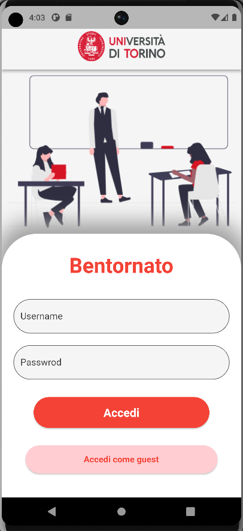
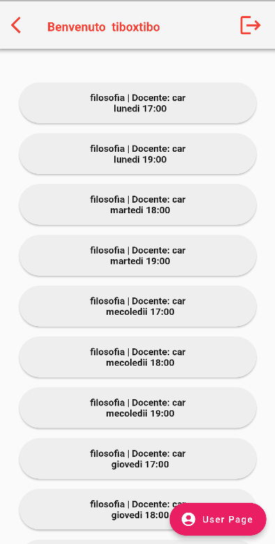
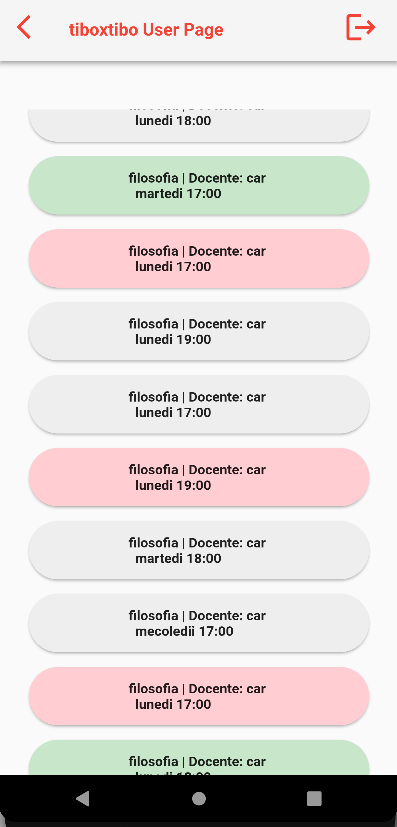

Progetto IUM-tweb(12 CFU) - Parte di Android

Il progetto è costituito anche da un'applicazione web: https://github.com/tiboxtibo/progetto_tweb

# Autori
Matteo Tiboldo 
Salvatore La Rosa

# Getting Started
Il progetto si avvia avviando il file main

Ricorda di avviare prima:
1) Xamp avviando Apache e Mysql
2) Tomcat da Intellj del progetto IUM-tweb (poichè ci colleghiamo al database tramite le servlet Java)
3) Emulatore android
4) Infine avviamo il main del progetto flutter

# Spiegazione progetto

Abbiamo creato un applicazione flutter collegandoci al server Tomcat e richiedendo i dati al 
database MySql tramite le Servlet Java del progetto https://github.com/tiboxtibo/progetto_tweb, 
tale applicazione ci permette di eseguire il login come utente, amministratore o ospite

Prenotare le lezioni che risultano disponibili

e mediante l'accesso alla UserPage di cancellarle o di confermarle

# Consegna progetto

Progetti laboratorio IUM e IUM/TWEB

Progetto di laboratorio – IUM+TWEB – 2022/23 (insegnamento da 12 CFU)

Si sviluppi un’applicazione java web che gestisca prenotazioni di ripetizioni online
essendo dotata sia di interfaccia utente per browser web che per accesso mobile.
Si assuma che per ogni corso di cui si offrono ripetizioni ci siano uno più docenti alternativi tra cui scegliere con chi fare la ripetizione (per es., lunedi dalle 9.00 alle 10.00 la lezione di matematica può essere tenuta sia da Mario Rossi che da Gianni Verdi).
Si assuma che ogni docente possa insegnare più di un corso (per es., Mario Rossi insegna sia matematica che scienze).
Si assuma che l’applicazione presenti le ripetizioni disponibili di una settimana pre-fissata, dal lunedi al venerdi, al pomeriggio (15.00 – 19.00). In altre parole, non è richiesto di gestire un vero calendario ma solo una griglia di slot temporali di dimensioni limitate (1h ciascuno). Ogni ripetizione disponibile è associata a un orario (dalle ore X alle ore Y del giorno Z) e ai docenti che la potrebbero tenere in quell’orario in quanto non occupati.

Seguono i dettagli richiesti per il progetto.

    L’applicazione deve gestire tre tipi di ruolo utente: utente ospite (non registrato), cliente (utente registrato del servizio di ripetizioni) e amministratore (utente registrato con ruolo admin). Si assuma di avere 1 amministratore pre-registrato.
    
    Nel dettaglio, l’applicazione deve permettere all’utente di eseguire le seguenti azioni:
    Pagina di registrazione, in cui si specifica l’account da creare (univoco nell’applicazione) - solo clienti, interfaccia web (HTML5).
    Visualizzare il catalogo delle ripetizioni disponibili, specificando i docenti disponibili per ogni ripetizione prenotabile - clienti e amministratori, interfaccia web e mobile.
    Prenotare una o più ripetizioni, tra quelle disponibili, scegliendo il corso e il docente desiderato – solo clienti, interfaccia web e mobile.
    Disdire una prenotazione specifica – clienti e amministratori, interfaccia web e mobile.
    Segnare una ripetizione come effettuata – solo clienti, interfaccia web e mobile.
    Visualizzare la propria lista delle prenotazioni. La lista deve includere sia le ripetizioni ancora da fruire che lo storico delle ripetizioni prenotate in passato (NB: se si rimuove un docente, o un corso, lo storico deve rimanere). Per ogni ripetizione in elenco, l’applicazione deve visualizzare lo stato della ripetizione (attiva/effettuata/disdetta) – solo clienti, interfaccia web e mobile.
    Visualizzare tutte le prenotazioni attive, effettuate e cancellate dei vari clienti - solo amministratore, solo interfaccia web.
    Inserire/rimuovere corsi e docenti, e associazioni corso-docente ai fini delle ripetizioni - solo amministratore, solo interfaccia web.
    
    NB: assumete che, quando parte l’applicazione, tutti i docenti siano disponibili in tutti gli slot temporali della griglia. Le loro disponibilità verranno cancellate man mano che i clienti prenoteranno le loro lezioni. Non sviluppate nessuna interfaccia utente per i docenti, essi non devono eseguire nessuna operazione sull’applicazione.

Requisiti tecnici:

    L’applicazione deve essere basata su architettura MVC, con Controller + viste e Model. Si noti che non deve esserci comunicazione diretta tra viste e model: ogni tipo di comunicazione tra questi due livelli deve essere mediato da un controller.
    È obbligatorio gestire le sessioni utente.
    L’applicazione deve salvare in un database relazionale a scelta i seguenti tipi di informazione:
    account, password e ruolo degli utenti registrati;
    titolo dei corsi di cui si offrono le ripetizioni;
    nome e cognome dei docenti che tengono le ripetizioni;
    associazioni corso-docente;
    prenotazioni di ripetizioni.
    L’applicazione deve controllare l’inserimento di input utente sia lato client che lato server per evitare che l’utente inserisca dati parziali o errati nei form (per esempio, per evitare che l’utente cerchi di collegarsi senza inserire login e password).
    L’applicazione deve controllare sia lato client che lato server che gli utenti non eseguano operazioni illecite. Per es., gli utenti non autenticati possono vedere il catalogo delle ripetizioni disponibili, ma non possono segnare come effettuate, o disdire, le prenotazioni; solo gli amministratori devono poter operare sul catalogo per inserire/rimuovere corsi e docenti; ogni utente (tranne l’amministratore) deve poter vedere solo le proprie ripetizioni e non quelle altrui.

Requisiti generali dell’interfaccia utente (sia web che mobile):

    L’interfaccia utente deve essere:
    Comprensibile (trasparenza). Per esempio, a fronte di errori, deve segnalare il problema; quando un’operazione viene eseguita con successo, deve visualizzare la conferma di esecuzione, a meno che la conferma non sia ridondante (in quanto il risultato si vede direttamente sull’interfaccia utente).
    Usabile secondo le linee guida viste a lezione.
    Ragionevolmente efficiente per permettere all’utente di eseguire le operazioni con un numero minimo di click e di inserimenti di dati.
    In caso di errore durante l’inserimento di dati nelle form, l’interfaccia deve permettere all’utente di correggere i dati e ripetere l’operazione senza perdere i dati precedentemente inseriti (cioè, senza riempire d’accapo i moduli online).
    Robusta rispetto all’input: ove possibile evitate di chiedere all’utente di inserire a mano gli identificatori - utilizzate menu tra cui l’utente può scegliere il valore desiderato per maggior comodità e per prevenire l’inserimento di dati errati (per esempio, se l’utente deve scegliere docente e corso per prenotare una ripetizione, proponene dei menu a tendina per la scelta anziché delle aree di input testuali).
    

Requisiti specifici per l’interfaccia utente per il web:

    La pagina di registrazione (quella in cui ci si registra per diventare clienti dell’applicazione) deve essere una pagina HTML5/CSS3 separata dal resto dell’applicazione. Questo per concentrare la sperimentazione relativa all’accessibilità in una sola pagina web, che non dipende da Vue.js. La pagina dovrà essere validata con i validatori W3C per quanto riguarda il codice HTML (https://validator.w3.org/) e CSS (https://jigsaw.w3.org/css-validator/), e con il validatore Achecker, per quanto riguarda il rispetto delle linee guida sull’accessibilità (https://achecker.achecks.ca/checker/index.php). Le validazioni andranno allegate al progetto.
    Tutto il resto dell’interfaccia web deve essere implementata come una sola Single Page Application utilizzando Vue.js e HTML5; Il layout delle pagine dell’interfaccia utente deve essere specificato con CSS (eventualmente utilizzando/estendendo fogli stile esistenti, come Bootstrap o simili) e deve essere fluido.
    Il controllo dell’input utente lato client deve essere effettuato utilizzando i tag di HTML5 e/o JavaScript.
    Il backend dell’applicazione deve essere implementato in Java.
    

Requisiti specifici per l’interfaccia utente Android:
    
    vincoli implementativi generali:
    
    l'applicazione puo’ essere scritta utilizzando Flutter (oppure  in Java/Kotlin usando in questo caso le librerie native Android).
    l’App deve essere sviluppata usando i componenti Flutter oppure Android. NON è permesso usare Browser Web o un loro emulatore come ad esempio "WebView". Nel dubbio chiedete prima.
    
    Per gli Studenti IUM+TWEB:
    L’interfaccia Mobile comunica col server del progetto TWEB, 1 server condiviso tra 2 client . La comunicazione col lato Server avviene tramite il formato JSON,
    NON e’ necessario rifare la pagina di registrazione anche per Android

# Ricorda

Gli url su windosow:
    final urlUtente = "http://10.0.2.2:8080/EsServlet_war_exploded/UtenteServlet";

Gli url su mac:
    final urlUtente = "http://localhost:8080/EsServlet_war_exploded/UtenteServlet";
(se utilizziamo emulatore di sistema IOS)

